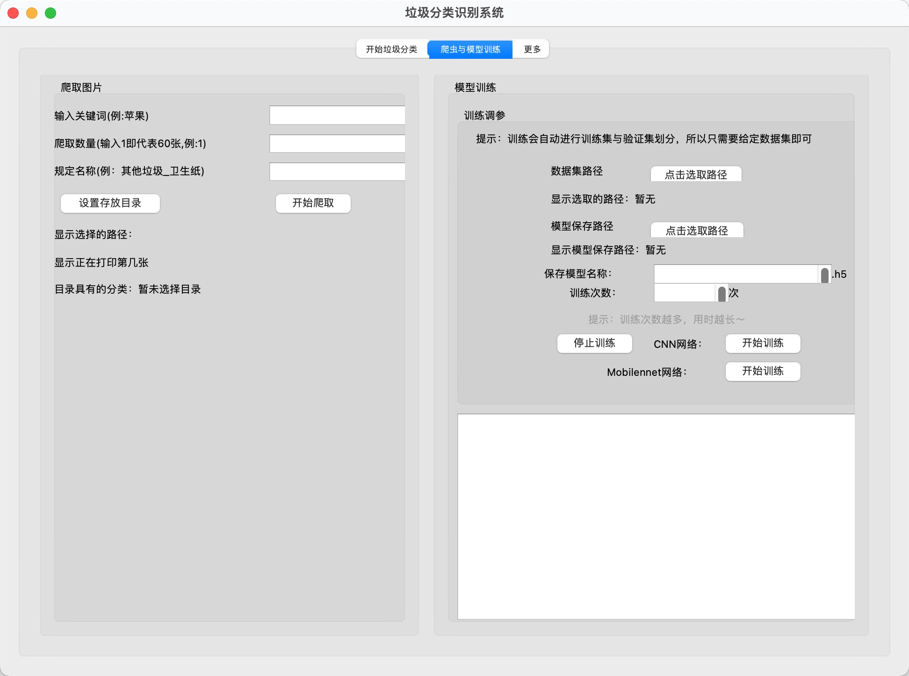

# Report_add_垃圾分类程序

## 1.简介

本次的报告的主要任务是制作一个款带有GUI界面的**“垃圾分类识别”**程序。程序可以实现简单的**垃圾分类识别**、网络爬取相关图片（可以当作数据集训练识别模型）、使用自带或爬取的数据集**训练识别模型**的功能，并且通过简单易懂的界面使用户易于**进行操作交互**，最大化地提供用户的使用效率。

报告完整版见：[报告完整版](https://gitee.com/rockyy10/machinelearning_homework/blob/master/Report%20add-%20垃圾分类软件制作/Report_add-%20垃圾分类软件制作.pdf)





## 2.软件功能

* 制作简易的**可交互界面**，便于使用者可以便捷操作，设定软件界面**自适应用户桌面分辨率**

* 使用者可以使用**“软件自带模型”**进行对图片的预测

* 使用者可以使用**“自己的模型”**对图片进行预测

* 使用者可以使用**“爬虫”**从网络上爬取所需要类别的图片，收集大量数据以供训练自己模型所用

* 对爬取的图片进行判定，判断其是否为**“空图片”或者“图片格式错误”**

* 使用者可以使用“爬取到的数据集”或者“自己的数据集”进行**CNN网络模型训练**并保存成.h5文件

* 使用者可以使用“爬取到的数据集”或者“自己的数据集”进行**Mobilenet网络模型训练**并保存成.h5文件

  具体使用方法：[报告完整版](https://gitee.com/rockyy10/machinelearning_homework/blob/master/Report%20add-%20垃圾分类软件制作/Report_add-%20垃圾分类软件制作.pdf)

  软件演示视频：[演示](https://gitee.com/rockyy10/machinelearning_homework/blob/master/Report%20add-%20垃圾分类软件制作/演示.mp4)

  

## 3.环境配置

本次的程序使用的是Anaconda中的envs虚拟环境，具体创建步骤：

打开终端输入：这里我们创建一个叫“Project_LAJI”的虚拟环境

```
conda create -n Project_LAJI python=3.9
```

激活虚拟环境

```
conda activate Project_LAJI
```

安装库函数

```
pip install tensorflow
pip install pyqt5
pip install pillow
pip install opencv-python
```

可能在安装时候会出现下载源链接未响应，此时我们可以选择国内清华源等

```
pip install tensorflow -i https://pypi.tuna.tsinghua.edu.cn/simple
```


## 4.模型训练数据

这里，在寻找训练网络的数据集时，我们可以选择使用程序自带的爬虫，进行每一类数据图片爬取；或者可以在网上找整合的数据集。

这里我在网上找到一个有较多种类图片分类的集合：

[百度网盘](https://pan.baidu.com/s/15MQm53SDvaLv0ILgYEW2Pw)      网盘密码：h94r


## 5.报告文件解释

Report add-垃圾分类软件制作.md/PDF ------报告
演示.mp4 ------软件演示视频
Project_LAJI ------项目工程文件夹


